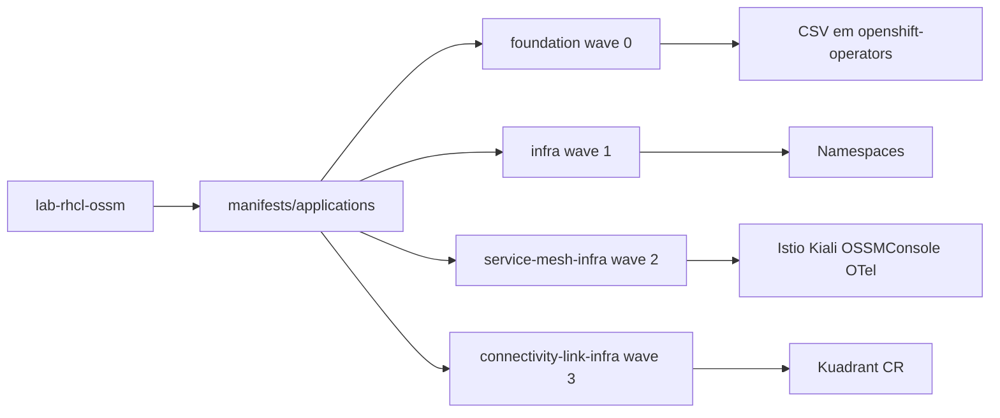

# rhcl-rhossm

Manifests GitOps para instalar **Red Hat OpenShift Service Mesh (OSSM) 3.2** em modo sidecar e **Red Hat Connectivity Link (RHCL) 1.3** em clusters OpenShift, usando **OpenShift GitOps** (Argo CD).

Repositório: [github.com/thegusmao/rhcl-rhossm](https://github.com/thegusmao/rhcl-rhossm)

## Visão geral

| Componente | Versão | Função |
|------------|--------|--------|
| OpenShift GitOps | OperatorHub | Argo CD / sync declarativo |
| OSSM (Sail Operator) | 3.2 (`stable-3.2`) | Control plane Istio, sidecar injection |
| RHCL (Kuadrant) | 1.3 | Gateway API, políticas DNS/TLS/rate limit |
| Kiali | 2.17.x | Console standalone e topologia do mesh |
| OSSM Console (OSSMC) | via Kiali Operator | Plugin Service Mesh no console OpenShift |
| OpenTelemetry | Red Hat build | Coleta de telemetria (base para Tempo) |
| User Workload Monitoring | OCP Monitoring | Prometheus para `PodMonitor`/`ServiceMonitor` em namespaces de app |
| cert-manager | Red Hat OpenShift | TLS para gateways e PKI Firesoft (namespace `cert-manager` no cluster) |

O blueprint de arquitetura multi-cluster (prod/DR, MetalLB, CoreDNS, mTLS) está em [`doc/architecture.md`](doc/architecture.md).

### Stack secure Firesoft (HTTPS + mTLS)

| Camada | Recurso | Path |
|--------|---------|------|
| PKI | Root + intermediárias `external` / `internal` | [`manifests/foundation/pki/`](manifests/foundation/pki/) |
| Mesh | istio-csr + `PeerAuthentication` STRICT | [`manifests/service-mesh/platform/`](manifests/service-mesh/platform/) |
| Borda | `secure-gateway` + `TLSPolicy` | [`manifests/connectivity-link/platform/`](manifests/connectivity-link/platform/) |
| Apps | `secure-app-a` → `secure-app-b` | [`manifests/apps/secure-aplication-{a,b}/`](manifests/apps/) |

Bootstrap da Root CA e verificação: [`doc/pki/firesoft-ca.md`](doc/pki/firesoft-ca.md).

URL de teste: `https://secure-app-a.external.firesoft.com.br/` (VIP MetalLB do `secure-gateway`).

## Estrutura do repositório

```
.
├── bootstrap/              # Aplicação manual uma vez por cluster
├── manifests/
│   ├── applications/       # App-of-apps: AppProjects + Applications
│   ├── foundation/         # Subscriptions OLM (operadores globais)
│   ├── infra/
│   │   ├── namespaces/     # namespaces, user-workload-monitoring, ClusterRole/Binding GitOps
│   │   ├── service-mesh/     # Istio, IstioCNI, Kiali, OSSMConsole, OpenTelemetry
│   │   └── connectivity-link/  # Kuadrant (RHCL)
│   ├── foundation/pki/     # PKI Firesoft (ClusterIssuers, intermediates)
│   ├── service-mesh/       # istio-csr, PeerAuthentication (platform)
│   └── connectivity-link/  # edge-gateway, secure-gateway, HTTPRoutes
└── doc/
    └── pki/                # Instruções geração Root CA e bootstrap
```

### Fluxo GitOps (app-of-apps)



1. **Bootstrap** — `Application` `lab-rhcl-ossm` sincroniza `manifests/applications`.
2. **foundation** (sync-wave 0) — operadores OLM em `manifests/foundation`.
3. **infra** (sync-wave 1) — `manifests/infra/namespaces` (RBAC cluster, namespaces com `managed-by`, `cluster-monitoring-config` com `enableUserWorkload: true`).
4. **service-mesh-infra** (sync-wave 2) — `manifests/infra/service-mesh`.
5. **connectivity-link-infra** (sync-wave 3) — `manifests/infra/connectivity-link`.

| Application | Path | Projeto |
|-------------|------|---------|
| `foundation` | `manifests/foundation` | `infra` |
| `infra` | `manifests/infra/namespaces` | `infra` |
| `service-mesh-infra` | `manifests/infra/service-mesh` | `infra` |
| `connectivity-link-infra` | `manifests/infra/connectivity-link` | `infra` |
| `service-mesh-platform` | `manifests/service-mesh/platform` | `infra` |
| `secure-aplicacao-a` / `secure-aplicacao-b` | `manifests/apps/secure-aplication-*` | `dev` |

## Pré-requisitos

- OpenShift Container Platform **4.18+** (OSSM 3.2) ou versão suportada pelo [RHCL 1.3](https://access.redhat.com/articles/7092611)
- `cluster-admin` para bootstrap e Subscriptions
- Catálogo `redhat-operators` disponível
- Subscriptions Red Hat ativas (OSSM, RHCL, OCP)
- **cert-manager** instalado no namespace `cert-manager` (este repositório não instala o operador; [`04-subscription-cert-manager.yaml`](manifests/foundation/04-subscription-cert-manager.yaml) permanece comentado). Antes do sync da PKI, crie o Secret `firesoft-root-ca` conforme [`doc/pki/firesoft-ca.md`](doc/pki/firesoft-ca.md)

## Bootstrap (primeira instalação)

Ordem sugerida:

```bash
# 1. Operador GitOps
oc apply -f bootstrap/00-subscription.yaml
oc wait argocd/openshift-gitops -n openshift-gitops --for=condition=Available --timeout=300s

# 2. Configuração Argo CD
oc apply -f bootstrap/01-argocd-cr.yaml

# 3. Credencial do repositório (copie o exemplo e preencha token/usuário)
cp bootstrap/03-secret-lab-rhcl-ossm.yaml.example bootstrap/03-secret-lab-rhcl-ossm.yaml
# edite bootstrap/03-secret-lab-rhcl-ossm.yaml — não commitar o secret real
oc apply -f bootstrap/03-secret-lab-rhcl-ossm.yaml

# 4. App-of-apps raiz
oc apply -f bootstrap/04-application-lab-rhcl-ossm.yaml
```

O Argo CD passa a gerenciar `foundation`, `infra`, `service-mesh-infra` e `connectivity-link-infra` automaticamente.

## RBAC do GitOps (Istio / IstioCNI cluster-scoped)

`Istio` e `IstioCNI` (`sailoperator.io`) são **Cluster-scoped**. O label `managed-by` nos namespaces não basta; a Application `infra` aplica:

- `ClusterRole` `openshift-gitops-infra-platform`
- `ClusterRoleBinding` para `openshift-gitops-argocd-application-controller` em `openshift-gitops`

Inclui também permissões antecipadas para Kiali, Kuadrant, OpenTelemetry, `ClusterRoleBinding` do Kiali (`cluster-monitoring-view`), Gateway API e APIs Istio usadas nas fases `platform`/`dev`.

## Observabilidade (User Workload Monitoring)

A Application `infra` aplica [`manifests/infra/namespaces/user-workload-monitoring.yaml`](manifests/infra/namespaces/user-workload-monitoring.yaml), que define o ConfigMap `cluster-monitoring-config` em `openshift-monitoring` com `enableUserWorkload: true`. Isso implanta o stack Prometheus/Thanos em `openshift-user-workload-monitoring` para coletar `PodMonitor` e `ServiceMonitor` em projetos de usuário.

Os namespaces `app-a` e `app-b` recebem a label `openshift.io/user-monitoring: "true"`. As Applications `aplicacao-a` e `aplicacao-b` (projeto `dev`) publicam `PodMonitor` que expõem métricas do sidecar Envoy (`/stats/prometheus`).

O Kiali consulta métricas agregadas via Thanos Querier (`thanos-querier.openshift-monitoring.svc:9091`), com RBAC em [`manifests/infra/service-mesh/kiali-rbac.yaml`](manifests/infra/service-mesh/kiali-rbac.yaml).

Se o sync de `infra` falhar ao criar o `ClusterRoleBinding`, aplique uma vez com cluster-admin:

```bash
oc apply -f manifests/infra/namespaces/clusterrole-openshift-gitops-infra.yaml
oc apply -f manifests/infra/namespaces/clusterrolebinding-openshift-gitops-infra.yaml
```

## Mesh + istio-csr (Firesoft CA)

O Istio CR em [`manifests/infra/service-mesh/istio.yaml`](manifests/infra/service-mesh/istio.yaml) define `global.caAddress` para o istio-csr **e** `pilot.env.ENABLE_CA_SERVER=false`. Sem desativar o CA embutido do istiod, o ConfigMap `istio-ca-root-cert` é reescrito com `O=cluster.local` e os sidecars falham TLS para o istio-csr.

PKI e trust: [`doc/pki/firesoft-ca.md`](doc/pki/firesoft-ca.md).

## Validação

```bash
# Operadores
oc get csv -n openshift-operators | egrep 'servicemesh|rhcl|kiali|opentelemetry|cert-manager'

# Service Mesh
oc get istio,istiocni -A
oc get pods -n istio-system -l app=istiod

# Connectivity Link
oc wait kuadrant/kuadrant -n kuadrant-system --for=condition=Ready=true --timeout=300s

# Kiali
oc get kiali -n istio-system
oc get route kiali -n istio-system

# OSSM Console plugin (após Kiali Ready)
oc get ossmconsole -n istio-system

# User Workload Monitoring (métricas de sidecar / PodMonitor)
oc get configmap cluster-monitoring-config -n openshift-monitoring -o jsonpath='{.data.config\.yaml}'
oc get pods -n openshift-user-workload-monitoring
oc get podmonitor -n app-a
```

No console OpenShift: categoria **Service Mesh** no menu principal (refresh do browser se solicitado após o install do plugin).

## AppProjects

| Projeto | Uso |
|---------|-----|
| `infra` | Operadores e instalação base (`foundation`, `infra`, `service-mesh-infra`, `connectivity-link-infra`) |
| `platform` | Recursos compartilhados em namespaces de plataforma (futuro) |
| `dev` | Workloads (`aplicacao-*`, `secure-aplicacao-*`) e HTTPRoutes RHCL |

Pastas: `manifests/service-mesh/platform`, `manifests/connectivity-link/{platform,dev}`.

## Documentação Red Hat

- [OSSM 3.2 — Installing](https://docs.redhat.com/en/documentation/red_hat_openshift_service_mesh/3.2/html/installing/ossm-installing-service-mesh)
- [RHCL 1.3 — Installing on OCP](https://docs.redhat.com/en/documentation/red_hat_connectivity_link/1.3/html/installing_on_openshift_container_platform/rhcl-install-on-ocp)
- [OpenShift GitOps](https://docs.redhat.com/en/documentation/red_hat_openshift_gitops)
- [Enabling monitoring for user-defined projects](https://docs.redhat.com/en/documentation/openshift_container_platform/latest/html/monitoring/enabling-monitoring-for-user-defined-projects)

## Licença

Este projeto está licenciado sob a [Apache License 2.0](LICENSE).
