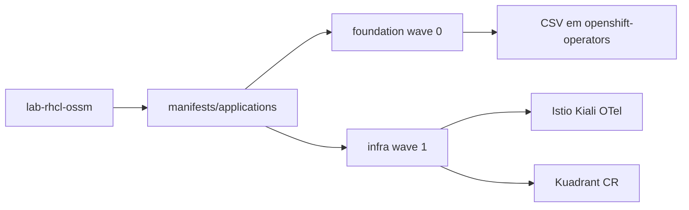

# rhcl-rhossm

Manifests GitOps para instalar **Red Hat OpenShift Service Mesh (OSSM) 3.2** em modo sidecar e **Red Hat Connectivity Link (RHCL) 1.3** em clusters OpenShift, usando **OpenShift GitOps** (Argo CD).

Repositório: [github.com/thegusmao/rhcl-rhossm](https://github.com/thegusmao/rhcl-rhossm)

## Visão geral

| Componente | Versão | Função |
|------------|--------|--------|
| OpenShift GitOps | OperatorHub | Argo CD / sync declarativo |
| OSSM (Sail Operator) | 3.2 (`stable-3.2`) | Control plane Istio, sidecar injection |
| RHCL (Kuadrant) | 1.3 | Gateway API, políticas DNS/TLS/rate limit |
| Kiali | 2.17.x | Console e topologia do mesh |
| OpenTelemetry | Red Hat build | Coleta de telemetria (base para Tempo) |
| cert-manager | Red Hat OpenShift | TLS para gateways (pré-requisito RHCL) |

O blueprint de arquitetura multi-cluster (prod/DR, MetalLB, CoreDNS, mTLS) está em [`doc/architecture.md`](doc/architecture.md).

## Estrutura do repositório

```
.
├── bootstrap/              # Aplicação manual uma vez por cluster
├── manifests/
│   ├── applications/       # App-of-apps: AppProjects + Applications
│   ├── foundation/         # Subscriptions OLM (operadores globais)
│   ├── infra/              # Namespaces, Istio, Kiali, OTel, Kuadrant
│   ├── service-mesh/       # Config por ambiente (platform/dev) — futuro
│   └── connectivity-link/  # Config RHCL por ambiente — futuro
└── doc/
```

### Fluxo GitOps (app-of-apps)



1. **Bootstrap** — `Application` `lab-rhcl-ossm` sincroniza `manifests/applications`.
2. **foundation** (sync-wave 0) — instala operadores via OLM.
3. **infra** (sync-wave 1) — namespaces, mesh e Connectivity Link.

## Pré-requisitos

- OpenShift Container Platform **4.18+** (OSSM 3.2) ou versão suportada pelo [RHCL 1.3](https://access.redhat.com/articles/7092611)
- `cluster-admin` para bootstrap e Subscriptions
- Catálogo `redhat-operators` disponível
- Subscriptions Red Hat ativas (OSSM, RHCL, OCP)
- **cert-manager Operator for Red Hat OpenShift** — se já existir no cluster, revise [`manifests/foundation/04-subscription-cert-manager.yaml`](manifests/foundation/04-subscription-cert-manager.yaml) antes do sync para evitar conflito OLM

## Bootstrap (primeira instalação)

Ordem sugerida:

```bash
# 1. Operador GitOps
oc apply -f bootstrap/00-subscription.yaml
oc wait argocd/openshift-gitops -n openshift-gitops --for=condition=Available --timeout=300s

# 2. Configuração Argo CD
oc apply -f bootstrap/01-argocd-cr.yaml

# 3. Credencial do repositório (copie o exemplo e preencha token/usuário)
cp bootstrap/03-secret-lab-rhcl-ossm.yaml.example bootstrap/03-secret-lab-rhcl-ossm.yaml
# edite bootstrap/03-secret-lab-rhcl-ossm.yaml — não commitar o secret real
oc apply -f bootstrap/03-secret-lab-rhcl-ossm.yaml

# 4. App-of-apps raiz
oc apply -f bootstrap/04-application-lab-rhcl-ossm.yaml
```

O Argo CD passa a gerenciar `foundation` e `infra` automaticamente.

## Validação

```bash
# Operadores
oc get csv -n openshift-operators | egrep 'servicemesh|rhcl|kiali|opentelemetry|cert-manager'

# Service Mesh
oc get istio,istiocni -A
oc get pods -n istio-system -l app=istiod

# Connectivity Link
oc wait kuadrant/kuadrant -n kuadrant-system --for=condition=Ready=true --timeout=300s

# Kiali
oc get kiali -n istio-system
oc get route kiali -n istio-system
```

## AppProjects

| Projeto | Uso |
|---------|-----|
| `infra` | Operadores, instalação base (`foundation`, `infra`) |
| `platform` | Recursos compartilhados em namespaces de plataforma (futuro) |
| `dev` | Workloads e políticas por aplicação (futuro) |

Pastas reservadas: `manifests/service-mesh/{platform,dev}`, `manifests/connectivity-link/{platform,dev}`.

## Documentação Red Hat

- [OSSM 3.2 — Installing](https://docs.redhat.com/en/documentation/red_hat_openshift_service_mesh/3.2/html/installing/ossm-installing-service-mesh)
- [RHCL 1.3 — Installing on OCP](https://docs.redhat.com/en/documentation/red_hat_connectivity_link/1.3/html/installing_on_openshift_container_platform/rhcl-install-on-ocp)
- [OpenShift GitOps](https://docs.redhat.com/en/documentation/red_hat_openshift_gitops)

## Licença

Este projeto está licenciado sob a [Apache License 2.0](LICENSE).
